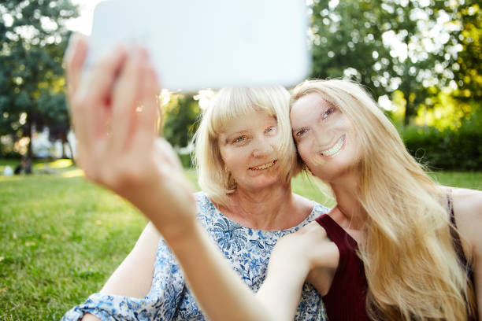
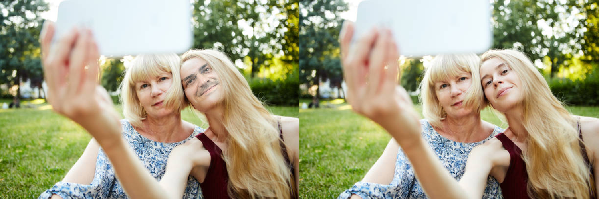
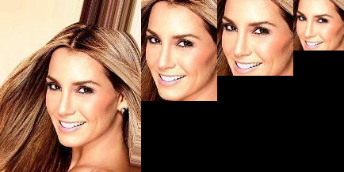
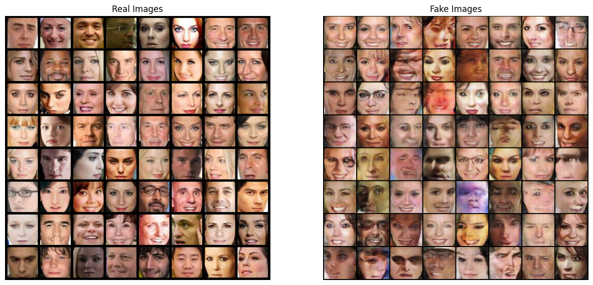
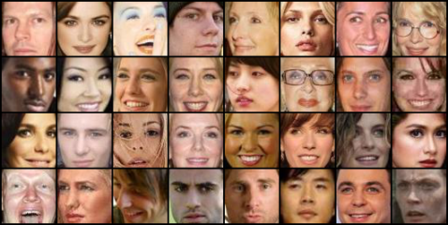
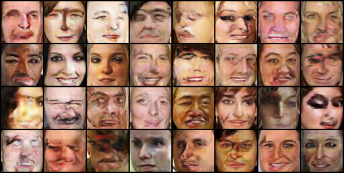
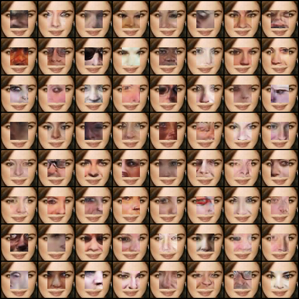
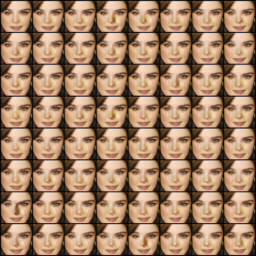
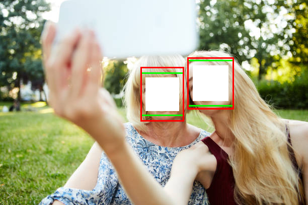

# De-identification

The goal of this code is to take an input image, containing one or several individuals, and anonymize all faces present.

## Table of Contents
- Version 2: [ Pre-trained GAN](#pretrained-gan)
- Version 1: [ DCGAN (end-to-end)](#dcgan)

## Pretrained GAN

Here a pretrained GAN will be used and aligned with the image

First model from end-to-end system

First generation from new architecture

## DCGAN

*Last visited 23/04/2023*

This was my first attempt at the problem and I sought to develop- an end-to-end solution to the problem.

The overall goal is to replace the obscured white area with a synthesized face, which looks realistic however is not identifiable as the original individual.

A gif of the full end-to-end process:

1. [Dataset Creation](#dataset-creation)
2. [DCGAN Image generation](#dcgan-image-generation)
3. [Facial Inpainting](#facial-inpainting)
4. [Group Images](#group-images)

### Dataset Creation

We make use of the CelebA dataset containing ~200k facial portrait images of celebrities. A MTCNN facial detection network is then used to detect faces within the image (note this is the same model used for facial detection later on). From here the images is cropped according to the detected face, centre cropped to make a square, then resized to 64x64. This took ~5 hours to process locally on laptop. The image below shows this process succinctly.

### DCGAN Image generation

A DCGAN is trained for 10 epochs on ~200k images from the dataset described above, namely the cropped detected faces from CelebA. A selection of the produced images is shown on the right

### Facial Inpainting

Here a section of the face is obscured, (32x32 in the middle for the small image below and 50x50 for the grid). Image inpainting optimizing perceptual and contextual loss is then used to generated a face

I tested 64 different latent noise vectors and trained them simultaneously. The below two images show they all converge to similar local minimum

### Group Images

The Synthesized faces are placed with a group image. This can involve using image inpainting several times.

